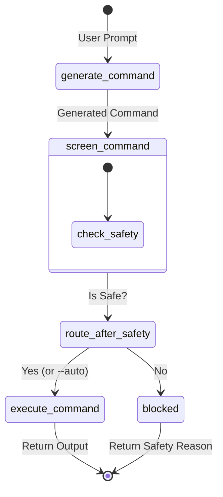

# 🤖 LangGraph PowerShell Agent

A Natural Language to Windows CLI (PowerShell/Bash) Agent powered by **LangGraph** and **Groq LLMs**. 

This agent translates your natural language requests into shell commands, automatically screens them for safety, and executes them with your confirmation. It acts as an intelligent assistant for your terminal, capable of both interactive sessions and one-off command executions.

---

## ✨ Features

- **🗣️ Natural Language Interface**: Describe what you want to do in plain English.
- **🛡️ Built-in Safety Screening**: Commands are analyzed for safety before execution. Unsafe or destructive commands are automatically blocked.
- **✅ User Confirmation**: By default, the agent asks for your confirmation before running any command, ensuring you stay in control.
- **🔄 Interactive Mode**: Continuous chat loop for executing multiple commands seamlessly.
- **🐳 Docker Support**: Run securely in an isolated container with PowerShell pre-installed.
- **⚡ Fast Inference**: Powered by Groq to deliver instant command generation.

---

## 🏗️ Architecture

The agent is built using a **LangGraph** state machine. Here is the workflow of how a prompt is processed:



1. **`generate_command`**: The LLM interprets the natural language prompt and generates a corresponding shell command.
2. **`screen_command`**: A safety check evaluates the command to ensure it's not harmful.
3. **`execute_command`**: The command is executed in the shell, capturing stdout and stderr.
4. **`blocked`**: If a command fails the safety check, it is blocked, and the reason is provided.

---

## 🛠️ Technology Stack

- **Framework**: [LangGraph](https://python.langchain.com/v0.2/docs/langgraph/) & [LangChain Core](https://python.langchain.com/v0.2/docs/core/)
- **LLM Provider**: [Groq](https://groq.com/) (`langchain-groq`)
- **Environment**: Python 3.11, Docker
- **Shell**: PowerShell (`pwsh`) / Bash

---

## 🚀 Getting Started

### Prerequisites
- Python 3.11+ (if running locally)
- Docker & Docker Compose (optional, but recommended for isolated execution)
- A [Groq API Key](https://console.groq.com/keys)

### 1. Clone the repository
```bash
git clone https://github.com/yourusername/pwsh-agent-langgraph.git
cd pwsh-agent-langgraph
```

### 2. Environment Setup
Copy the example environment file and add your Groq API key:
```bash
cp .env.example .env
```
Edit `.env` to include your `GROQ_API_KEY`:
```env
GROQ_API_KEY=gsk_your_api_key_here
GROQ_MODEL=llama3-70b-8192 # Optional: Defaults to gemini-3.1-pro or gpt-4o-mini
```

### 3. Installation

**Option A: Running locally (Python Virtual Environment)**
```bash
python -m venv .venv
source .venv/bin/activate  # On Windows: .venv\Scripts\activate
pip install -r requirements.txt
```

**Option B: Running with Docker (Recommended)**
```bash
docker-compose build
docker-compose run --rm pwshagent
```

---

## 🎮 Usage

You can run the agent in two modes: **Interactive Mode** or **Single-Shot Mode**.

### Interactive Mode
Run the script without any arguments to start the interactive chat session:
```bash
python main.py
```
*Example session:*
```
WinCliAgent — type a request, or 'exit' to quit.

> list all python files in the current directory
  command : Get-ChildItem -Filter *.py
  details : Uses Get-ChildItem to list all files with the .py extension in the current directory.

Run this command? [y/N] y
```

### Single-Shot Mode
Provide your request directly as command-line arguments:
```bash
python main.py "find all empty directories"
```

### Auto-Execute (Bypass Confirmation)
If you trust the generated commands (and the safety screener), you can use the `--auto` flag to execute commands immediately without the `[y/N]` prompt:
```bash
python main.py "print hello world" --auto
```

---

## 🛡️ Safety & Limitations

- The agent has a built-in safety node to prevent `rm -rf /` or malicious scripts, but **never run `--auto` with root privileges**. 
- Always review the `command` and `details` output before confirming execution.
